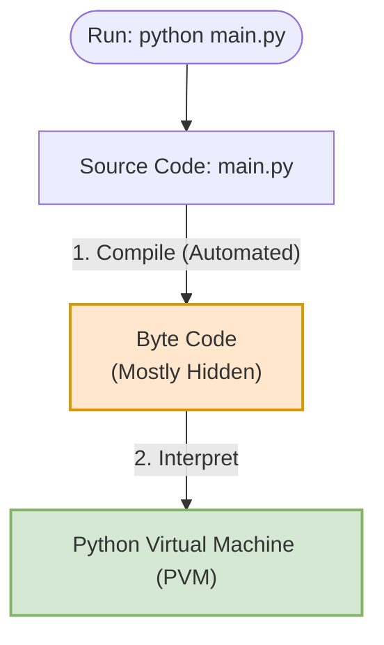

## Python

Python is a high-level, interpreted programming language known for its simplicity and readability. Unlike compiled languages such as C++ or Java, Python code is not converted into machine code before execution. Instead, it is processed at runtime by an interpreter.

### Inner Working

When you run a Python program (e.g., `python main.py`), Python performs a multi-step process under the hood to execute your code:

#### Detailed Process:

1. **Compilation to Byte Code**
   - **Low-level & Platform Independent:** Python source code (`.py`) is compiled into Byte Code, which is a lower-level representation of your code.
   - **Mostly Hidden:** This compilation is an automated background step.
   - **Runs Faster:** Running pre-compiled byte code is faster than parsing source code on the fly.
   - **Caching (`.pyc` & `__pycache__`):**
     - The compiled byte code is stored as `.pyc` files (sometimes called _frozen binaries_) inside a folder named `__pycache__`.
     - **Only for imported files:** This caching behavior **works only for imported files (modules)**. It is **not** performed for top-level/main script files (the primary entry point run directly via `python script.py`).
     - **Naming Convention:** The generated `.pyc` files are named based on the source filename, Python implementation, and Python version (e.g., `my_module.cpython-312.pyc` for `my_module.py` running under CPython 3.12).
     - Python automatically rebuilds these cached files if there is a **source change** or a change in the **Python version**, speeding up startup times on subsequent runs.

2. **Python Virtual Machine (PVM)**
   - **Runtime Engine:** The PVM is the runtime engine (also known as the **Python Interpreter**) that reads and executes the byte code instructions.
   - **Code Loop:** It runs a continuous loop to iterate through and execute the byte code instructions.
   - **Platform Independence:** Because byte code is platform-independent, it can run on any operating system that has a compatible PVM installed.
   - **Byte Code is NOT Machine Code:**
     - Byte code is a Python-specific representation, not direct CPU machine code. It requires specific interpretation by the PVM.
   - **Python Implementations:**
     - **CPython:** The standard implementation of Python, written in C.
     - **Jython:** A Java implementation of Python.
     - **IronPython:** An implementation designed for the Microsoft .NET Framework.
     - **Stackless:** Python implementation focused on concurrency without using the standard C call stack.
     - **PyPy:** A fast implementation of Python utilizing a Just-In-Time (JIT) compiler.

---

### Core Language Features

1. **Garbage Collection & Memory Management**
   The PVM automatically manages memory using a garbage collection mechanism. It tracks object references and automatically deallocates memory when objects are no longer referenced, freeing programmers from manual memory handling.

2. **Dynamic Typing**
   Python determines variable types at runtime (dynamically typed) rather than compile time. This allows variables to change types during execution, offering high flexibility and ease of development.

3. **Memory References & Mutability**
   Python variables are pointers to memory objects. Some types can be changed in-place (mutable), while others cannot (immutable).
   👉 **Read the full guide here:** [Memory References & Mutability](./memory_reference.md)

4. **Built-in Data Types**
   Python provides a rich set of built-in data types (like numbers, sequences, sets, and mappings), categorized by their mutability.
   👉 **Read the full guide here:** [Python Data Types](./datatype.md)
