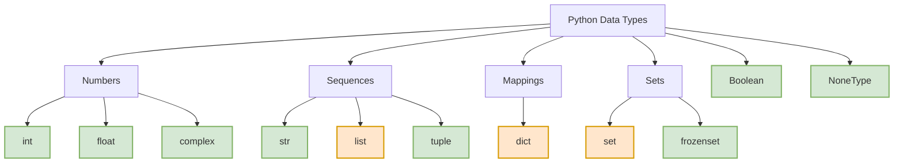

# Python Data Types 📊

In Python, every value has a data type. Since Python is a **dynamically typed** language, you do not need to declare the type of a variable explicitly. Python detects the type of the value assigned to the variable automatically at runtime.

---

## 🗺️ Data Types Hierarchy

Here is a visual breakdown of Python's standard built-in data types and their mutability:


*   🟩 **Green boxes** are **Immutable** (cannot be changed in-place).
*   🟧 **Orange boxes** are **Mutable** (can be changed in-place).

---

## 📋 Built-in Data Types Summary

| Category | Type Name | Example | Mutability | Description |
|:---|:---|:---|:---|:---|
| **Numbers** | `int` | `10`, `-5` | Immutable | Whole numbers (arbitrary precision in Python 3). |
| | `float` | `10.5`, `-0.01` | Immutable | Decimal numbers / floating-point representation. |
| | `complex` | `3 + 4j` | Immutable | Numbers containing real and imaginary parts. |
| **Sequences**| `str` | `"hello"` | Immutable | Sequence of Unicode characters. |
| | `list` | `[1, 2, 3]` | **Mutable** | Ordered collection of items (heterogeneous). |
| | `tuple` | `(1, 2, 3)` | Immutable | Ordered, immutable collection of items. |
| **Mappings** | `dict` | `{"id": 1}` | **Mutable** | Collection of key-value pairs. |
| **Sets** | `set` | `{1, 2, 3}` | **Mutable** | Unordered collection of unique items. |
| | `frozenset`| `frozenset({1})`| Immutable | Immutable version of a set. |
| **Boolean** | `bool` | `True`, `False`| Immutable | Binary states (subclass of `int`). |
| **None** | `NoneType`| `None` | Immutable | Special constant representing the absence of value. |

---

## 🔍 Detailed Overview of Core Types

### 1. Numbers (`int`, `float`, `complex`)
Python automatically handles size allocation for integers so they never overflow.
```python
x = 12345678901234567890  # Large int
y = 12.34                 # Float
z = 2 + 3j                # Complex (real: 2, imag: 3)
```

### 2. Strings (`str`)
Strings are immutable sequences of characters enclosed in single, double, or triple quotes.
```python
greeting = "Hello World"
multiline = """This is a
multi-line string"""
```

### 3. Lists (`list`)
Lists are ordered, mutable, and allow duplicate values.
```python
fruits = ["apple", "banana", "cherry"]
fruits[0] = "blueberry"   # Allowed (Mutable)
fruits.append("orange")
```

### 4. Tuples (`tuple`)
Tuples are ordered and immutable. They are faster than lists and safe from accidental writes.
```python
coordinates = (10.0, 20.0)
# coordinates[0] = 15.0   # TypeError! (Immutable)
```

### 5. Dictionaries (`dict`)
Dictionaries store data in key-value pairs. Keys must be of an immutable type (e.g., strings, numbers, or tuples) and must be unique.
```python
user = {"name": "Alice", "age": 25}
user["age"] = 26          # Allowed (Mutable)
```

### 6. Sets (`set`)
Sets are unordered collections of unique elements. They are useful for membership testing and removing duplicates.
```python
unique_numbers = {1, 2, 3, 3, 4} # Results in {1, 2, 3, 4}
```

---

## 🛠️ Type Checking and Conversion

### Checking Types
You can check types using `type()` or verify them using `isinstance()` (recommended for production):
```python
x = 10
print(type(x))           # <class 'int'>
print(isinstance(x, int)) # True
```

### Type Conversion (Casting)
You can convert variables from one type to another using constructor functions:
```python
num_str = "100"
num = int(num_str)       # String to Int (100)
decimal = float(num)     # Int to Float (100.0)
text = str(decimal)      # Float to String ("100.0")
```
