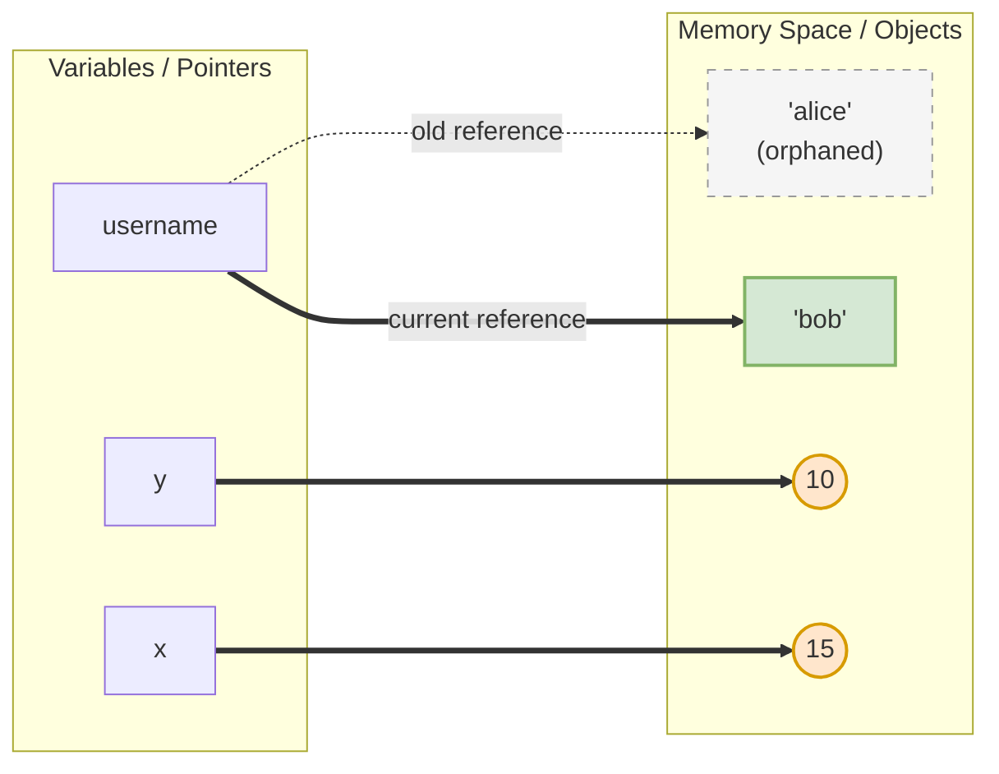
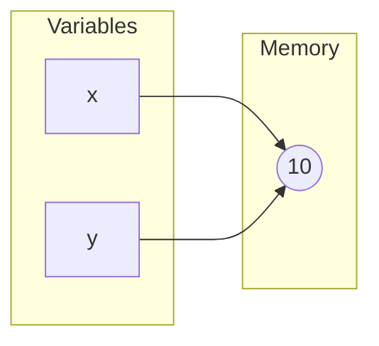
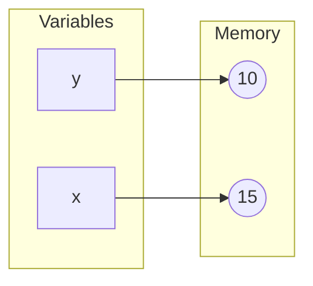
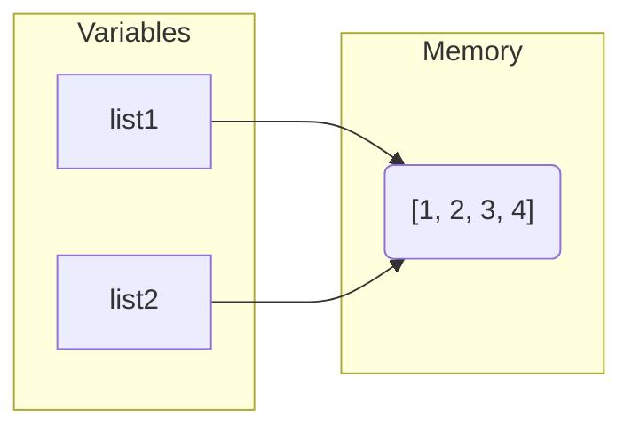

# Python Memory Reference & Mutability 🧠

In Python, everything is an object. Understanding how variables point to these objects in memory is key to avoiding common bugs and writing efficient code.

---

## 🎯 Overview: Memory Reference Layout

Here is a unified representation of variables pointing to objects in memory (matching the concept in your drawing):

```python
username = "alice"
username = "bob"

x = 10
y = x
x = 15
```


*Note: Since strings and integers are **immutable**, Python creates a new object in memory when the value changes rather than updating the existing memory in-place.*

---

## 📌 1. How Variables work (References)

Unlike other languages where a variable is a "box" that stores a value, in Python, a **variable is just a label/pointer** that points to an object in memory.

### The Example:

```python
x = 10
y = x
x = 15
```

Let's see how this looks in memory step-by-step:

#### Step 1: `x = 10` and `y = x`
Both `x` and `y` point to the same memory location containing the integer `10`.



#### Step 2: `x = 15`
Because integers are **immutable** (cannot be changed in place), Python does not change the number `10` to `15`. Instead, it creates a new object `15` in memory and points `x` to it. `y` continues to point to `10`.



---

## 🔄 2. Mutable vs Immutable Types

In Python, data types are divided into two main categories:

### 🚫 Immutable (Cannot be modified in-place)
When you modify an immutable object, Python actually creates a **new object** in a new memory location.
* **Types:** `int`, `float`, `string`, `tuple`, `bool`, `frozenset`.
* **Example:**
  ```python
  username = "alice"
  username = "bob" 
  # A new string object "bob" is created, and username points to it.
  # The old "alice" object will eventually be cleaned up by Garbage Collection.
  ```

### ✏️ Mutable (Can be modified in-place)
When you modify a mutable object, it changes **directly in its memory location**. Any other variables pointing to that same object will see the change.
* **Types:** `list`, `dict`, `set`.
* **Example:**
  ```python
  list1 = [1, 2, 3]
  list2 = list1
  list1.append(4)
  
  print(list2) # Output: [1, 2, 3, 4]
  ```

#### Memory visualization for Mutable modification:

*Because both variables point to the exact same list object in memory, modifying `list1` automatically updates what `list2` sees.*

---

## 🔍 3. Checking Memory Addresses

You can check the memory address of any object using the built-in `id()` function:

```python
x = 10
y = x
print(id(x) == id(y)) # True (They point to the same object)

x = 15
print(id(x) == id(y)) # False (x now points to a new object)
```
