# Python Memory Reference & Mutability 🧠

In Python, everything is an object. Understanding how variables point to these objects in memory is key to avoiding common bugs and writing efficient code.

---

## 🎯 Overview: Memory Reference Layout

Here is a unified representation of variables pointing to objects in memory (matching the concept in your drawing):

```python
username = "alice"
username = "bob"

x = 10
y = x
x = 15
```

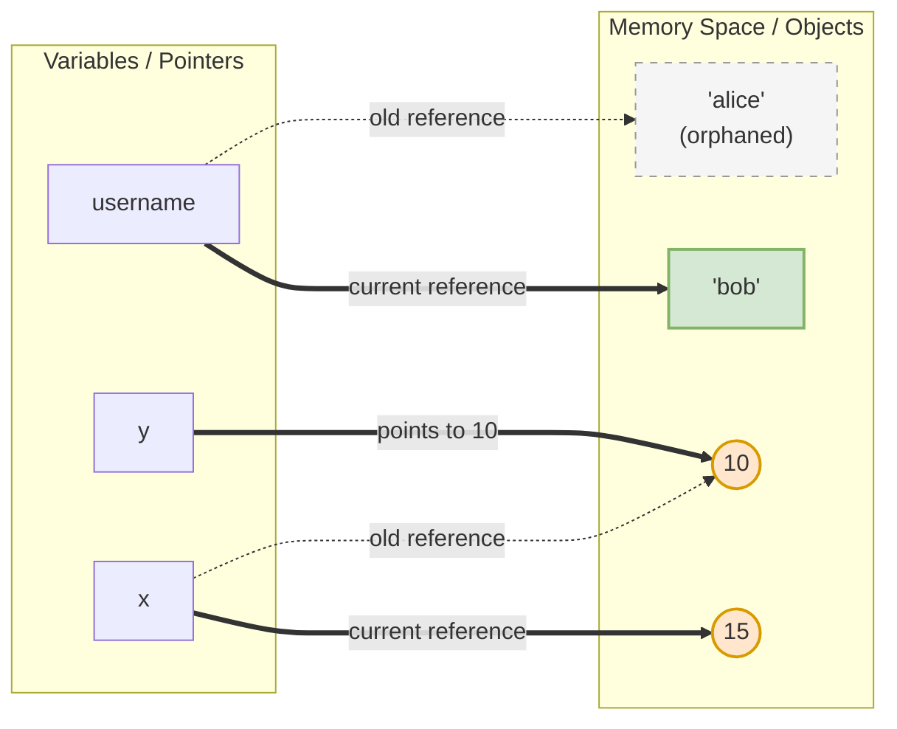
*Note: Since strings and integers are **immutable**, Python creates a new object in memory when the value changes rather than updating the existing memory in-place.*

---

## 📌 1. How Variables work (References)

Unlike other languages where a variable is a "box" that stores a value, in Python, a **variable is just a label/pointer** that points to an object in memory.

### The Example:

```python
x = 10
y = x
x = 15
```

Let's see how this looks in memory step-by-step:

#### Step 1: `x = 10` and `y = x`
Both `x` and `y` point to the same memory location containing the integer `10`.

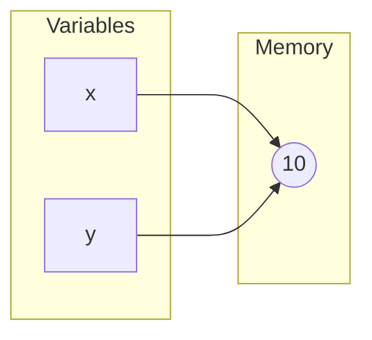

#### Step 2: `x = 15`
Because integers are **immutable** (cannot be changed in place), Python does not change the number `10` to `15`. Instead, it creates a new object `15` in memory and points `x` to it. `y` continues to point to `10`.

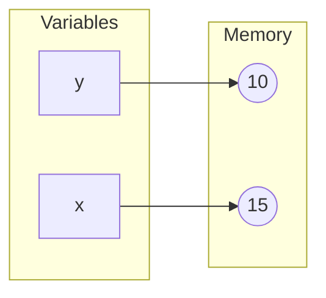

---

## 🔄 2. Mutable vs Immutable Types

In Python, data types are divided into two main categories:

### 🚫 Immutable (Cannot be modified in-place)
When you modify an immutable object, Python actually creates a **new object** in a new memory location.
* **Types:** `int`, `float`, `string`, `tuple`, `bool`, `frozenset`.
* **Example:**
  ```python
  username = "alice"
  username = "bob" 
  # A new string object "bob" is created, and username points to it.
  # The old "alice" object will eventually be cleaned up by Garbage Collection.
  ```

### ✏️ Mutable (Can be modified in-place)
When you modify a mutable object, it changes **directly in its memory location**. Any other variables pointing to that same object will see the change.
* **Types:** `list`, `dict`, `set`.
* **Example:**
  ```python
  list1 = [1, 2, 3]
  list2 = list1
  list1.append(4)
  
  print(list2) # Output: [1, 2, 3, 4]
  ```

#### Memory visualization for Mutable modification:
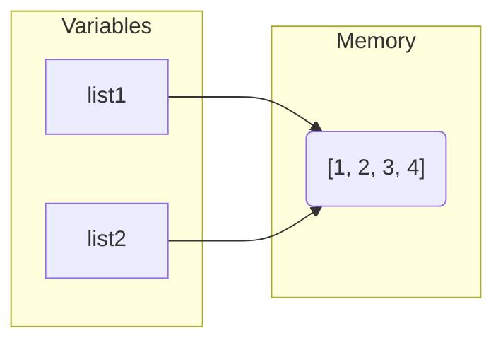
*Because both variables point to the exact same list object in memory, modifying `list1` automatically updates what `list2` sees.*

---

## 🔍 3. Checking Memory Addresses

You can check the memory address of any object using the built-in `id()` function:

```python
x = 10
y = x
print(id(x) == id(y)) # True (They point to the same object)

x = 15
print(id(x) == id(y)) # False (x now points to a new object)
```

---

## 💡 4. Deep Dive Examples: Shared References & Reassignment

Let's look at more complex cases of mutable and immutable references in action.

### Case A: Mutating a Shared List vs. Creating a New List

Here is what happens when two list references (`l1` and `l2`) share a reference and then one is modified or reassigned.

#### Scenario 1: Mutating the List In-place (`l1[0] = 44`)
```python
l1 = [1, 2, 3]
l2 = l1
l1[0] = 44
```

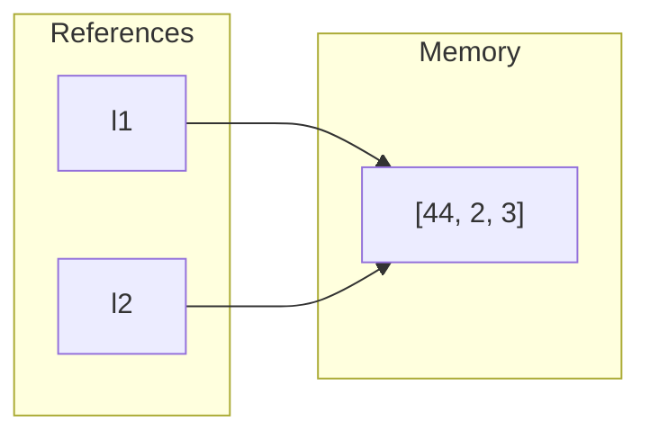
* **Explanation:** Since lists are **mutable**, `l1[0] = 44` alters the list object directly in memory. Since `l2` points to the exact same list, printing `l2` shows `[44, 2, 3]`.

#### Scenario 2: Reassigning to a New List (`p2 = [1, 2, 3]`)
```python
p1 = [1, 2, 3]
p2 = p1
p2 = [1, 2, 3] # Reassignment
p1[0] = 55
```

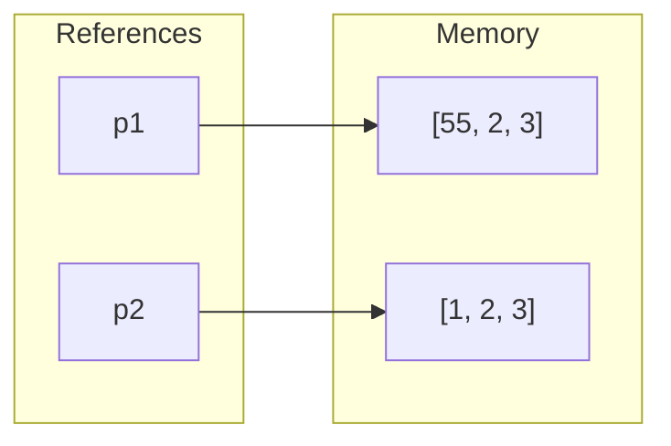
* **Explanation:** When `p2 = [1, 2, 3]` is executed, the `[]` syntax creates a **completely new list object** in memory. `p2` is pointed to this new object, while `p1` remains connected to the original list. Modifying `p1[0] = 55` only affects the original list.

---

### Case B: Integer Reassignment & Reference Counting

Let's look at math operations on immutable integers and how Python manages references.

```python
a = 5
b = 2
a = a + 2  # a now points to 7
```

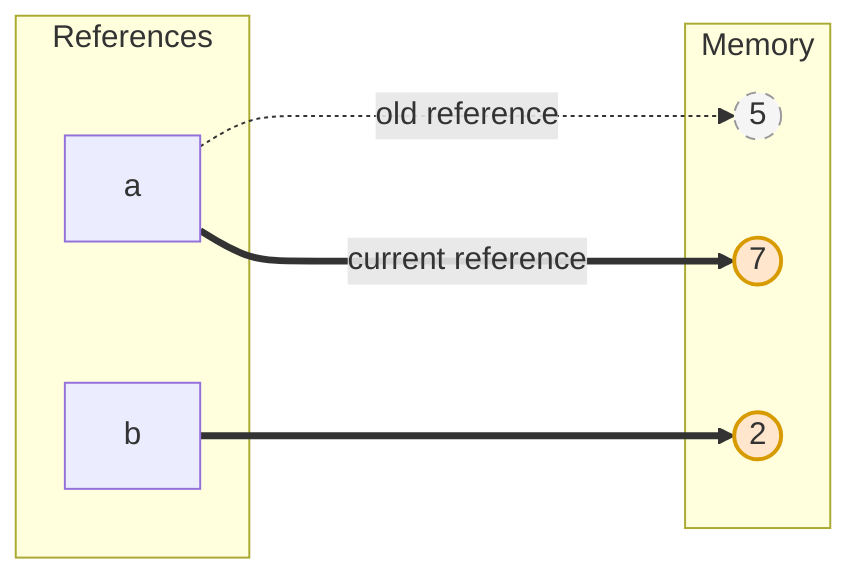
* **Explanation:** 
  - Initially, `a` points to `5`.
  - When we compute `a + 2` (`5 + 2 = 7`), Python creates a new integer object `7` (since integers are **immutable** and cannot be modified in-place).
  - Variable `a` is then re-bound (pointed) to the object `7`. The object `5` remains in memory, but `a` no longer references it.

#### ⚙️ Reference Counting & Garbage Collection
In Python, objects in memory keep a track of how many active variable references point to them. This is called **Reference Counting**:
* If `score = 10` and `a_score = 10`, both point to the same integer `10`, raising the reference count for `10` to `2`.
* When an object's reference count drops to `0` (meaning no variables point to it anymore, like the `'alice'` string in our overview or `5` if `a` was the only variable pointing to it), Python's **Garbage Collector** automatically destroys the object to free up memory.

---

### Case C: Shallow Copy vs. Deep Copy

When you want to clone a list (or any collection) instead of just sharing its reference, Python offers different ways of copying: **Shallow Copy** (using slicing `[:]` or `.copy()`) and **Deep Copy** (using the `copy` module).

#### 1. Shallow Copy using Slicing (`h2 = h1[:]`)
Slicing creates a new list object, but copies only the *references* of the items inside it.

```python
h1 = [1, 2, 3]
h2 = h1[:]
h1[0] = 55
```

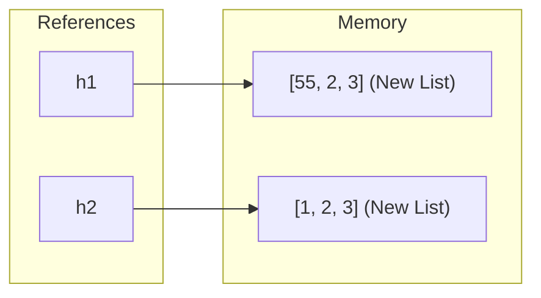
* **Explanation:** Slicing `h1[:]` creates a new list container for `h2`. Because it is a separate list container, modifying `h1[0] = 55` does **not** affect `h2`. Both lists now exist independently in memory.

#### ⚠️ The Shallow Copy Limitation (Nested Objects)
If the list contains nested mutable objects (like nested lists), a shallow copy will still share references to those inner objects:

```python
h1 = [[1, 2], 3]
h2 = h1[:] # Shallow copy
h1[0][0] = 99

print(h2) # Output: [[99, 2], 3] (Shared inner list changed!)
```

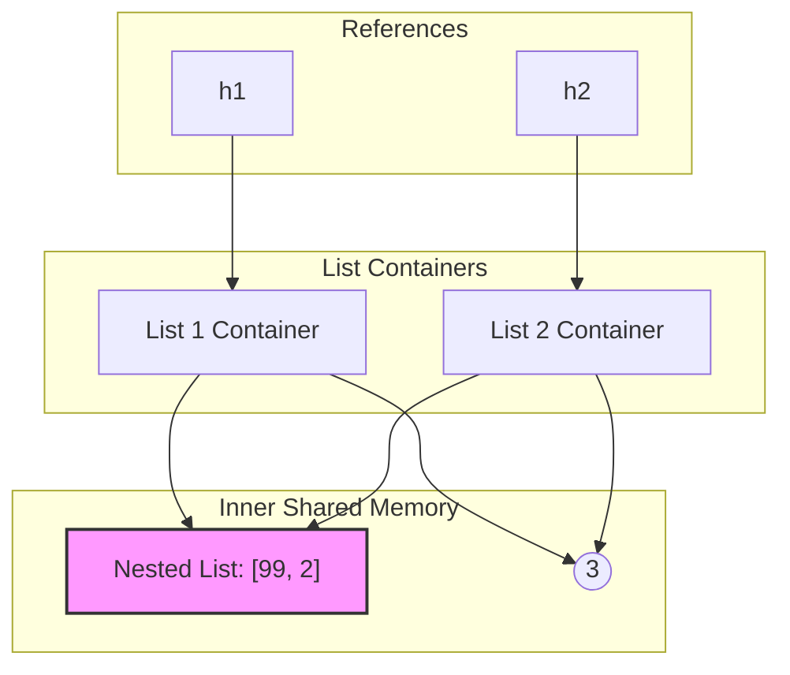

---

#### 2. Deep Copy (`copy.deepcopy()`)
To completely clone an object, including all nested mutable objects recursively, you must use `copy.deepcopy()` from the `copy` library:

```python
import copy

h1 = [[1, 2], 3]
h2 = copy.deepcopy(h1) # Deep copy
h1[0][0] = 55

print(h2) # Output: [[1, 2], 3] (Completely independent!)
```

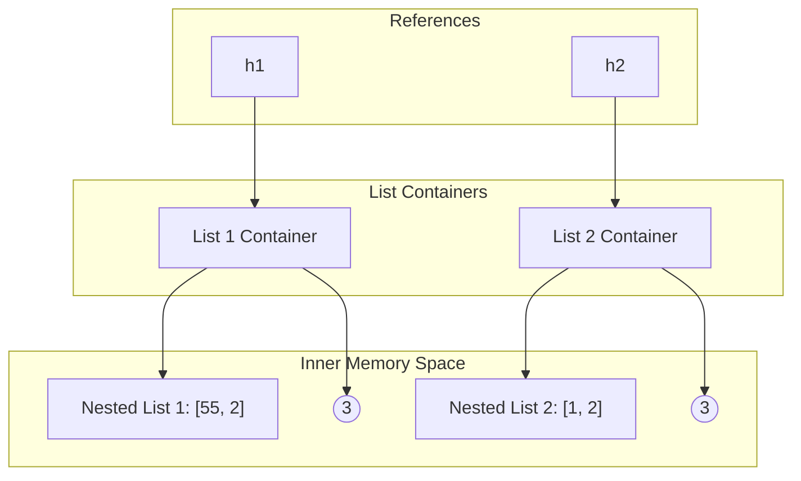
* **Explanation:** `copy.deepcopy()` duplicates not just the outer container, but recursively copies all nested elements as well, creating a completely independent copy in memory.

---

## ⚖️ 5. Equality (`==`) vs. Identity (`is`)

Understanding memory references helps clarify the difference between the **Equality** (`==`) and **Identity** (`is`) operators.

| Operator | Name | What it Compares |
|:---|:---|:---|
| `==` | **Equality** | **Value/Data:** Checks if the values of the two objects are equal. |
| `is` | **Identity** | **Memory Location:** Checks if the variables point to the exact same object in memory (`id(a) == id(b)`). |

### The Example:

```python
n = [1, 2, 3]
m = n

print(m == n) # True  (Values are the same)
print(m is n) # True  (They point to the same list object)
```

#### State 1: `m = n` (Same Reference)
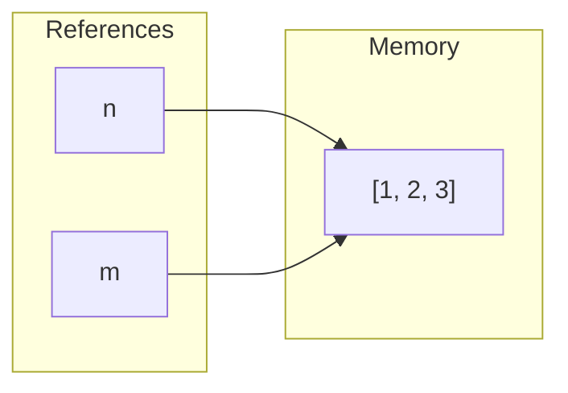

---

```python
n = [1, 2, 3]
m = [1, 2, 3]

print(m == n) # True  (Values are still the same)
print(m is n) # False (They point to different list objects in memory)
```

#### State 2: `m = [1, 2, 3]` and `n = [1, 2, 3]` (Different References)
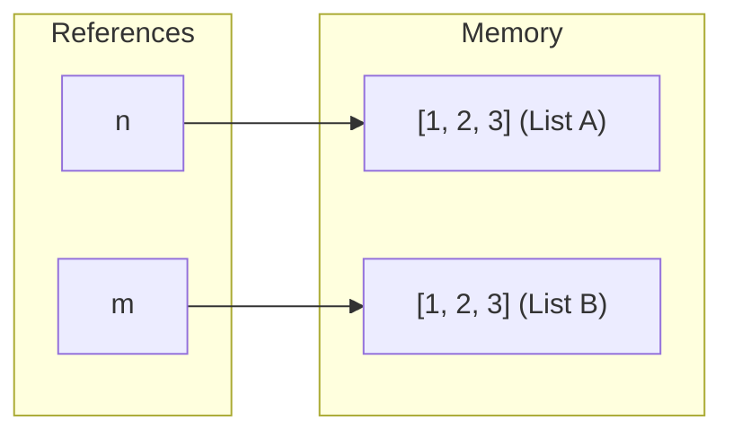
