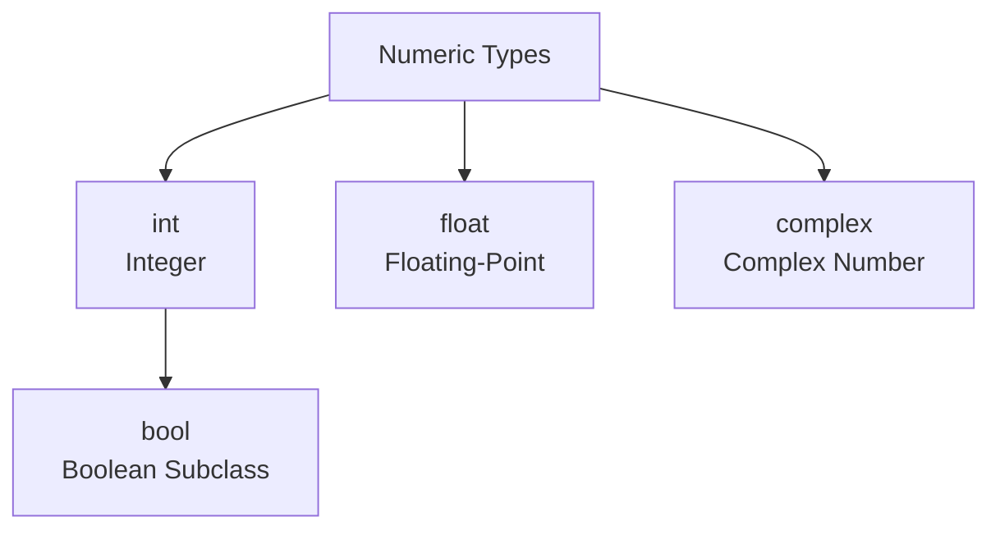
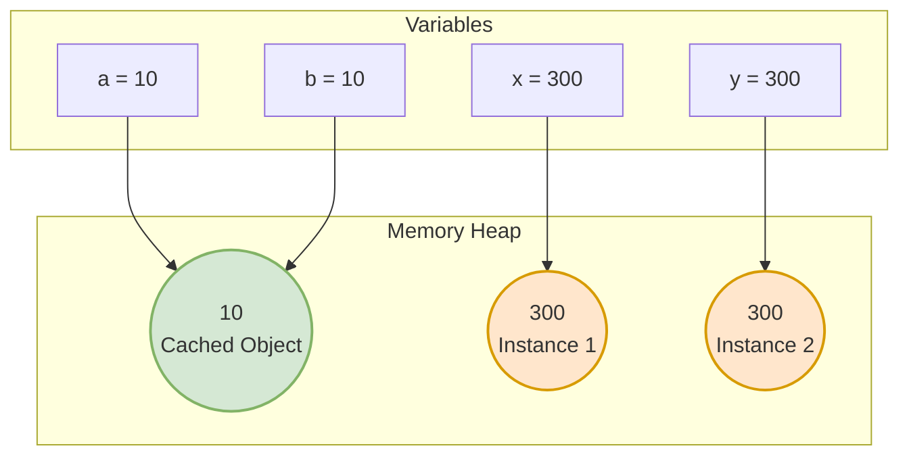

# Python Numbers: Deep Dive 🔢

Python provides robust support for numerical data. All numbers in Python are **immutable objects**. This means once a number object is created, its value cannot be changed. Modifying a numeric variable re-binds it to a new object in memory.

---

## 🗺️ Numeric Types Hierarchy

Python has three built-in numeric types:



---

## 🧠 1. Integers (`int`)

Integers represent whole numbers (positive, negative, or zero). 

### ⚙️ Arbitrary Precision (Unlimited Size)
Unlike languages like C++ or Java where integers have a fixed size (e.g., 32-bit or 64-bit) and can overflow, Python 3 integers have **arbitrary precision**. An integer can grow as large as your computer's available memory:
```python
x = 9999999999999999999999999999999999999999999999  # Works perfectly!
print(x * x)                                        # No overflow!
```

### ⚡ Integer Caching (Optimization)
For performance, Python pre-allocates and caches integers in the range **`-5` to `256`** when the interpreter starts.
* Any variable assigned to a number in this range points to the **same cached object** in memory.
* Assigning numbers outside this range creates **separate objects** in memory.



```python
a = 10
b = 10
print(a is b)  # True (Reuses the cached object)

x = 300
y = 300
print(x is b)  # False (Separate objects in memory)
```

### 🔢 Representation in Different Bases
You can write integers in binary, octal, or hexadecimal format using prefixes:
* **Binary (`0b` or `0B`):** `0b1010` (Decimal `10`)
* **Octal (`0o` or `0O`):** `0o12` (Decimal `10`)
* **Hexadecimal (`0x` or `0X`):** `0xa` or `0x10` (Decimal `10` or `16`)

---

## 🌊 2. Floating-Point Numbers (`float`)

Floats represent real numbers and are implemented using double-precision (64-bit) format following the **IEEE 754 standard**.

### ⚠️ Representation Error / Floating-Point Accuracy
Because computers represent numbers in binary, certain decimal values cannot be represented with absolute precision. This leads to subtle calculations issues:

```python
print(0.1 + 0.2)  # Output: 0.30000000000000004
print(0.1 + 0.2 == 0.3)  # Output: False
```

#### How to handle Float comparison:
1. **Using `math.isclose()`:**
   ```python
   import math
   print(math.isclose(0.1 + 0.2, 0.3))  # Output: True
   ```
2. **Using the `decimal` module:**
   ```python
   from decimal import Decimal
   print(Decimal('0.1') + Decimal('0.2') == Decimal('0.3'))  # Output: True
   ```

### 🪐 Special Float Values
Floats support three special values:
* **Infinity:** `float('inf')`
* **Negative Infinity:** `float('-inf')`
* **Not a Number (NaN):** `float('nan')`

---

## 🌀 3. Complex Numbers (`complex`)

Complex numbers have a real and imaginary part, represented with a `j` suffix for the imaginary part.
```python
c = 3 + 4j
print(c.real)       # Output: 3.0
print(c.imag)       # Output: 4.0
print(c.conjugate()) # Output: (3-4j)
```

---

## 🏛️ 4. Advanced Math: Decimals & Fractions

For applications requiring exact precision (like financial software) or rational math, Python provides standard library modules.

### 💰 The `decimal` Module
Allows user-defined exact decimal precision.
```python
from decimal import Decimal, getcontext
getcontext().prec = 4  # Set precision limit

a = Decimal('1.1')
b = Decimal('3')
print(a / b)  # Output: 0.3667 (exact rounding to 4 digits)
```

### 🍕 The `fractions` Module
Allows working with rational fractions directly, avoiding floating point representations.
```python
from fractions import Fraction
f1 = Fraction(1, 3)
f2 = Fraction(1, 6)
print(f1 + f2)  # Output: 1/2
```

---

## 🛠️ 5. Common Mathematical Operations

### Division Types:
* **True Division (`/`):** Always returns a float. E.g., `5 / 2 = 2.5`
* **Floor Division (`//`):** Truncates the decimal part. E.g., `5 // 2 = 2`, `-5 // 2 = -3`
* **Modulo (`%`):** Returns the remainder. E.g., `5 % 2 = 1`

### Built-in Functions:
* `abs(x)`: Returns the absolute value.
* `round(x, n)`: Rounds to `n` decimal places.
* `divmod(x, y)`: Returns a tuple containing quotient and remainder `(x // y, x % y)`.
* `pow(x, y)`: Equivalent to `x ** y`.
