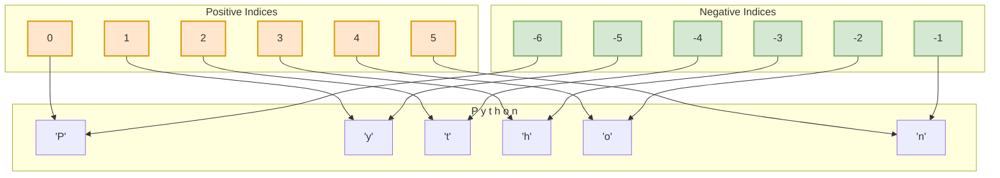
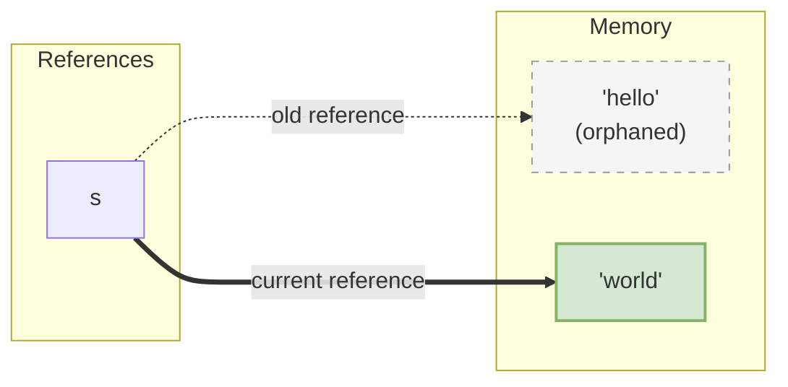

# Python Strings: Deep Dive 🧵

In Python, a string is a sequence of Unicode characters. Strings are one of the most widely used data types. In Python, **strings are immutable**, meaning their values cannot be modified in-place after they are created.

---

## 📌 1. String Creation & Multilines

Strings can be created using single (`'`), double (`"`), or triple (`'''` or `"""`) quotes:

```python
single = 'Hello'
double = "World"
# Triple quotes are used for multi-line strings or docstrings
multiline = """This is a
multi-line string."""
```

---

## 🗺️ 2. String Indexing & Slicing

Python strings can be indexed starting from `0` (positive indexing) or from `-1` (negative indexing, starting from the end of the string).



### Slicing Syntax: `string[start:stop:step]`
* **`start`**: Index where the slice starts (inclusive). Defaults to `0`.
* **`stop`**: Index where the slice ends (exclusive). Defaults to string length.
* **`step`**: Determines the increment between indices. Defaults to `1`.

```python
num_list = "0123456789"

# Slicing the whole string
print(num_list[:])      # '0123456789'

# Slicing from index 3 to the end
print(num_list[3:])     # '3456789' (indices 3 to 9)

# Slicing from start up to index 7 (exclusive)
print(num_list[:7])     # '0123456' (indices 0 to 6)

# Slicing with step of 2 (taking every 2nd character)
print(num_list[0:7:2])  # '0246' (indices 0, 2, 4, 6)

# Slicing with step of 3 (taking every 3rd character)
print(num_list[0:7:3])  # '036' (indices 0, 3, 6)

# Reverse the string
print(num_list[::-1])   # '9876543210'
```

---

## 🔒 3. Immutability & Memory Behavior

Since strings are **immutable**, any operation that modifies a string (like concatenation or replacement) does not modify the original string object. Instead, it creates a **new string object** in memory.

```python
s = "hello"
s = "world" # The original "hello" is orphaned, s now points to "world"
```



---

## ⚡ 4. Escape Sequences & Raw Strings

### Escape Sequences
Escape sequences let you include special characters in a string:
* `\n`: Newline
* `\t`: Tab
* `\\`: Backslash
* `\'`: Single quote
* `\"`: Double quote

```python
# Escaping double quotes inside a double-quoted string
quote = "He said, \"Learning Python is awesome\""
print(quote) # Output: He said, "Learning Python is awesome"

# Newline example
multiline = "First\nSecond"
print(multiline)
# Output:
# First
# Second
```

### Raw Strings (`r""`)
If you prefix a string with `r` or `R`, Python treats backslashes as literal characters rather than escape characters. This is extremely useful for file paths or regular expressions to prevent errors.

#### ⚠️ The Unicode Escape Error
If you write a standard string representing a path containing `\u` (like `\user`), Python interprets `\u` as the prefix for a Unicode code point. This causes a syntax error:

```python
# Fails with SyntaxError: (unicode error) 'unicodeescape' codec can't decode...
path = "c:\user\documents" 
```

#### The Solutions:
1. **Use a Raw String (`r"..."`):**
   ```python
   path = r"c:\user\documents"
   print(path) # Output: c:\user\documents
   ```
2. **Double-Escape the Backslashes (`\\`):**
   ```python
   path = "c:\\user\\documents"
   print(path) # Output: c:\user\documents
   ```

---

## 📝 5. String Formatting

Python has three ways to format strings. F-strings are the modern, recommended approach.

### 1. F-Strings (Python 3.6+) - Recommended 🚀
F-strings are fast and readable. They allow you to embed variables and expressions directly.

#### Storing F-String in a Variable:
Instead of printing directly, you can assign the F-string to a variable name and use it later:
```python
name = "Alice"
age = 25

# Assigned to a variable first
message = f"My name is {name} and I am {age} years old."
print(message) # Output: My name is Alice and I am 25 years old.

# Supports expressions & rounding format
next_year = f"Next year I will be {age + 1}."
pi_value = f"Pi is roughly {3.14159:.2f}"
```

---

### 2. `.format()` Method
This method allows you to define a template string first and inject variables later.

#### Option A: Positional Placeholders
```python
template = "I ordered {} items of type {}"
message = template.format(3, "Notebook")
print(message) # Output: I ordered 3 items of type Notebook
```

#### Option B: Named Placeholders (Highly Readable)
You can define named placeholders in the template and pass them as keyword arguments:
```python
template = "My name is {name} and I am {age} years old."

# Filled later using key-value arguments
message = template.format(name="Bob", age=30)
print(message) # Output: My name is Bob and I am 30 years old.
```

### 3. `%` Formatting (Old Style)
```python
print("Hello %s, you are %d years old." % ("Charlie", 30))
```

---

## 🛠️ 6. Core String Methods

Here are the practical examples of the most common built-in string methods using generic variable names and values:

### 1. Case Conversions (`lower()`, `upper()`)
Converts string casing. Since strings are **immutable**, these methods return a new string, leaving the original string unchanged.

```python
text = "Python Programming"

print(text.lower()) # Output: "python programming"
print(text.upper()) # Output: "PYTHON PROGRAMMING"
print(text)         # Output: "Python Programming" (Original is unchanged)
```

---

### 2. Removing Whitespaces (`strip()`)
Removes leading and trailing whitespaces from a string.

```python
text = "   Python Programming   "

print(text)         # Output: "   Python Programming   " (With spaces)
print(text.strip()) # Output: "Python Programming" (Spaces removed)
```

---

### 3. Replacing Substrings (`replace()`)
Replaces occurrences of a substring with a new substring. Like other string methods, it returns a new string.

```python
text = "Red Balloon"

print(text.replace("Red", "Blue")) # Output: "Blue Balloon"
print(text)                        # Output: "Red Balloon" (Original is unchanged)
```

---

### 4. Splitting Strings (`split()`)
Splits a string into a list of substrings based on a separator.

```python
# Default split (by spaces/newlines)
text = "Apple, Banana, Cherry, Date"
print(text.split()) 
# Output: ['Apple,', 'Banana,', 'Cherry,', 'Date']

# Splitting by a specific separator (comma + space)
print(text.split(", ")) 
# Output: ['Apple', 'Banana', 'Cherry', 'Date']
```

---

### 5. Finding & Counting Substrings (`find()`, `count()`)
* **`find()`**: Locates the index of the first occurrence of a substring (case-sensitive). Returns `-1` if not found.
* **`count()`**: Counts the total occurrences of a substring.

```python
text = "Python Programming"
print(text.find("Pro")) # Output: 7 (Starts at index 7)
print(text.find("pro")) # Output: -1 (Not found due to case-sensitive matching)

# Counting occurrences
text_repeats = "Python Coding Python Practice Python Help"
print(text_repeats.count("Python")) # Output: 3
```

---

### 6. Joining Lists Into Strings (`join()`)
Joins elements of a list/iterable into a single string using different specified separators.

```python
items = ["Apple", "Banana", "Cherry"]

print("".join(items))   # Output: "AppleBananaCherry" (No separator)
print(" ".join(items))  # Output: "Apple Banana Cherry" (Space separator)
print("-".join(items))  # Output: "Apple-Banana-Cherry" (Hyphen separator)
print(", ".join(items)) # Output: "Apple, Banana, Cherry" (Comma + space separator)
```

---

### 7. Substring Membership Testing (`in` operator)
Checks if a substring is present within a string. Returns `True` if found, and `False` otherwise (case-sensitive).

```python
text = "Python Programming"

print("Python" in text)  # Output: True
print("Java" in text)    # Output: False
print("python" in text)  # Output: False (Case-sensitive)
```

---

## 🔁 7. String Length & Iteration

### Checking String Length (`len()`)
The built-in `len()` function returns the total number of characters in a string (including spaces and punctuation).

```python
text = "Python Code"
print(len(text)) # Output: 11
```

### Iterating Through a String
Since strings are iterable sequences of characters, you can loop through them using a `for` loop:

```python
text = "Python"
for char in text:
    print(char)

# Output:
# P
# y
# t
# h
# o
# n
```
