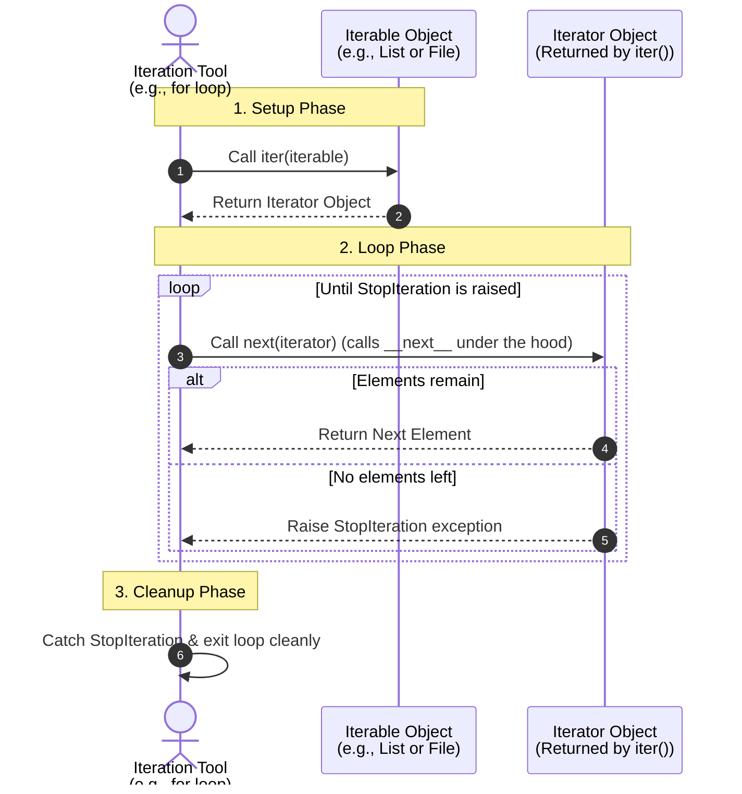
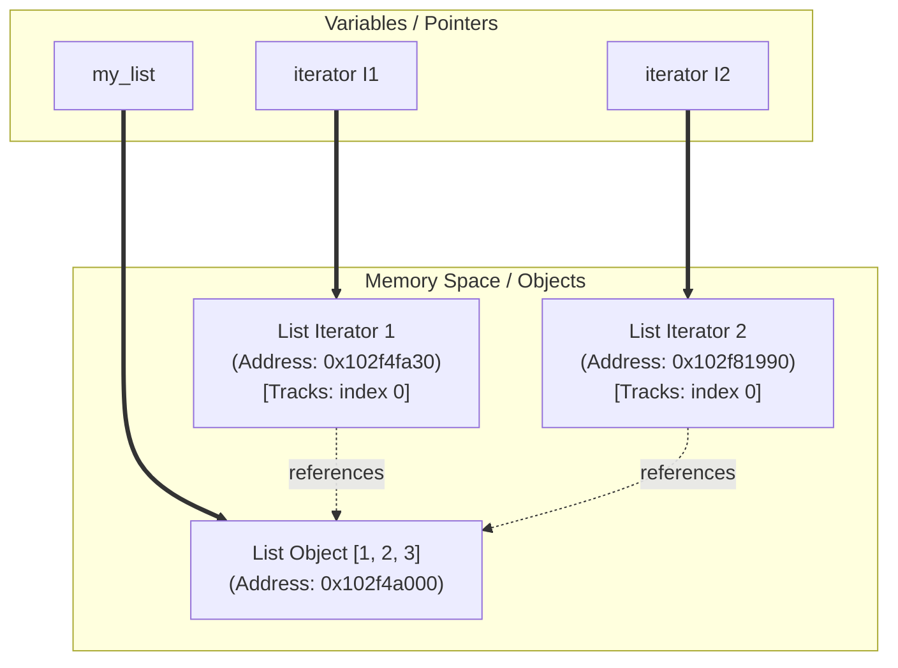
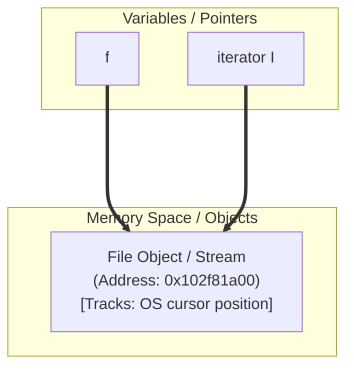

# Python Iteration: Under the Hood ⚙️

In Python, we loop over lists, strings, and files all the time using `for` loops. But have you ever wondered **how** Python actually does this behind the scenes? 

Let's break down the magic of **Iterables**, **Iterators**, and **Iteration Tools** in simple, easy-to-understand language!

---

## 🔑 1. The Core Concepts

To understand iteration, you need to know three terms:

1. **Iterable**: 
   - **What it is**: Any object you can loop over (e.g., `list`, `tuple`, `dict`, `str`, `set`, or a file object).
   - **Characteristics**: It contains data but doesn't know "where" it is in a loop. It has a special method called `__iter__()` that can create an iterator.
2. **Iterator**: 
   - **What it is**: The helper agent that actually walks through the elements one by one.
   - **Characteristics**: It remembers its current position. It has a special method called `__next__()` (or the `next()` function) to fetch the next item.
3. **Iteration Tool**: 
   - **What it is**: The mechanism that triggers the iteration (e.g., `for` loops, list comprehensions, `map`, `filter`).

---

## 🗺️ 2. How Iteration Works (Visual Diagram)

Here is a visual flow of how an **Iteration Tool** (like a `for` loop) interacts with an **Iterable Object** (like a list `[1, 2, 3, 4]` or a file):



---

## 🛠️ 3. Hands-on Examples (Under the Hood)

Let's see how this works in Python shell using generic examples.

### Example A: Iterating a List Manually
Suppose we have a list: `numbers = [10, 20, 30]`. 
If we want to loop through it manually without a `for` loop, we do this:

```python
# 1. We get the iterator using iter()
numbers = [10, 20, 30]
my_iterator = iter(numbers)

# 2. We call next() to fetch items
print(next(my_iterator))  # Output: 10
print(next(my_iterator))  # Output: 20
print(next(my_iterator))  # Output: 30

# 3. What happens when we call next() again?
print(next(my_iterator))
# ❌ Raises StopIteration exception!
```

---

### Example B: File Iteration (`readline()` vs `__next__()`)
Files in Python are special. They are both iterables and their own iterators! 

Let's say we have a file called `sample.py` with the following content:
```python
import time
print("hello world")
username = "alex"
print(username)
```

There are two ways to read this file line-by-line using Python:

#### Method 1: Using `readline()` (Soft Stop)
`readline()` returns an empty string `''` when it reaches the end of the file. It does **not** raise an error.

```python
f = open('sample.py')

print(f.readline())  # Output: 'import time\n'
print(f.readline())  # Output: 'print("hello world")\n'
print(f.readline())  # Output: 'username = "alex"\n'
print(f.readline())  # Output: 'print(username)'
print(f.readline())  # Output: ''  (End of file reached)
print(f.readline())  # Output: ''  (Keeps returning empty string)
f.close()
```

#### Method 2: Using `__next__()` / `next()` (Hard Stop)
Iterators use `__next__()`. When they reach the end of the file, they raise `StopIteration`. This is how Python's loops know exactly when to stop!

```python
f = open('sample.py')

print(f.__next__())  # Output: 'import time\n'
print(f.__next__())  # Output: 'print("hello world")\n'
print(f.__next__())  # Output: 'username = "alex"\n'
print(f.__next__())  # Output: 'print(username)'
print(f.__next__())  
# ❌ Raises Traceback: StopIteration!
f.close()
```

---

## 🔄 4. How the `for` Loop Mimics this Behavior

When you write this simple loop:
```python
for line in open('sample.py'):
    print(line, end='')
```

Python executes it equivalent to this `while` loop behind the scenes:
```python
# What Python does under the hood:
f = open('sample.py')
iterator = iter(f) # Gets iterator (for files, it returns itself)

while True:
    try:
        line = next(iterator) # Calls iterator.__next__()
        print(line, end='')
    except StopIteration:
        # StopIteration was raised, meaning the file ended!
        break # Exit the loop cleanly
```

---

## 📊 Summary: Comparing the Two Approaches

| Feature | `readline()` | `next(iterator)` / `__next__()` |
| :--- | :--- | :--- |
| **End of File behavior** | Returns an empty string `''` | Raises `StopIteration` |
| **Loop compatibility** | Requires manually checking for `if not line` | Automatically handled by `for` loops |
| **State management** | Moves file cursor forward | Moves file cursor forward + manages iteration lifecycle |

---

## 🆚 5. Deep Dive: `iter()` on Lists (Arrays) vs. Files & Memory Reference Layout 🧠

When you run Python code in the interactive shell, you often see memory addresses like `<list_iterator object at 0x102f4fa30>`. 
Let's understand what is happening in the system's memory and why calling `iter()` behaves differently for lists/arrays versus files in terms of **Memory References**.

---

### 1. Lists (Arrays) & Memory References

When you create a list:
```python
my_list = [1, 2, 3]
```
- `my_list` is a variable pointing to a **List Object** at a specific memory location (e.g., `0x102f4a000`).

When you call `iter(my_list)` twice:
```python
I1 = iter(my_list)
I2 = iter(my_list)
```
- Python allocates **two new separate iterator objects** in memory (e.g., `I1` at `0x102f4fa30` and `I2` at `0x102f81990`).
- Each iterator object stores:
  1. A reference pointer back to the original list object.
  2. Its own **state/index** tracking where it is in the iteration (e.g., index `0`).

#### 🗺️ Memory Reference Layout for Lists:


#### Why does it do this? (Multiple Iterations)
Since the iterator objects (`0x102f4fa30` and `0x102f81990`) are separate from the list itself (`0x102f4a000`):
- `iter(my_list) is my_list` evaluates to **`False`** (they point to different memory addresses).
- You can iterate through the list **independently and concurrently** (e.g., nested loops). Each iterator maintains its own index pointer without interfering with the other.

---

### 2. Files & Memory References

When you open a file:
```python
f = open('sample.py')
```
- `f` is a variable pointing to a **File Object/Stream** at a specific memory location (e.g., `0x102f81a00`).

When you call `iter(f)`:
```python
I = iter(f)
```
- Python **does not create a new object**. Instead, it returns a reference to the **exact same File Object**!
- Both `f` and `I` point to the same address `0x102f81a00`.

#### 🗺️ Memory Reference Layout for Files:


#### Why does it do this? (Single Cursor/Stream)
- **Shared Cursor**: A file stream has a single physical read-cursor managed directly by the Operating System. You cannot read two different parts of the same file stream independently at the same time in parallel.
- Because the file stream itself keeps track of its cursor, the file object acts as its own iterator. Its `__iter__()` method simply returns `self` (itself).
- Therefore, `iter(f) is f` evaluates to **`True`** (both variables point to the exact same memory address).

---

### 📊 Summary: List Iterator vs. File Iterator

| Collection Type | Calling `iter()` returns... | Memory Address of Iterator | Is `iter(obj) is obj`? | Can run nested/independent loops? |
| :--- | :--- | :--- | :--- | :--- |
| **List (Array)** | A new `<list_iterator>` object | **Different** address (e.g., `0x102f4fa30`) | **`False`** | **Yes** (Each loop gets its own iterator/cursor) |
| **File** | The file object itself | **Same** address (e.g., `0x102f81a00`) | **`True`** | **No** (Single shared cursor moves forward) |

---

## 🔑 6. Dictionary Iteration Under the Hood

When you loop over a dictionary in Python, you are iterating over its **keys** by default.

Let's say we have a dictionary:
```python
D = {'a': 1, 'b': 2}
```

If we iterate over it:
```python
for key in D:
    print(key)
# Output:
# a
# b
```

### What happens under the hood?
1. Calling `iter(D)` returns a **`<dict_keyiterator>`** object.
2. Every time you call `next()` on this key-iterator, it returns the next key in the dictionary.
3. When there are no more keys left, it raises `StopIteration`.

Here is the manual execution:
```python
>>> D = {'a': 1, 'b': 2}
>>> I = iter(D)
>>> I
<dict_keyiterator object at 0x...>

>>> next(I)
'a'
>>> next(I)
'b'
>>> next(I)
# ❌ Raises Traceback: StopIteration!
```

> [!NOTE]
> Python dictionaries also support other views that return iterators:
> - `iter(D.keys())` returns a `<dict_keyiterator>` (iterates over keys).
> - `iter(D.values())` returns a `<dict_valueiterator>` (iterates over values).
> - `iter(D.items())` returns a `<dict_itemiterator>` (iterates over `(key, value)` tuples).

---

## 🔢 7. Range Iteration Under the Hood

The `range()` function in Python creates a range object. It is a lazy sequence, meaning it does not store all the numbers in memory at once. Instead, it generates them on demand.

### What happens under the hood?
1. `R = range(5)` is an **iterable**, but not an iterator itself.
2. When you call `iter(R)`, it returns a new **`<range_iterator>`** object.
   - Just like lists, `iter(R) is R` is **`False`**. This allows you to run multiple nested loops over the same range object simultaneously.
3. Every time you call `next()` on this range-iterator, it returns the next integer.
4. When the end of the range is reached, it raises `StopIteration`.

Here is the manual execution:
```python
>>> R = range(5)
>>> R
range(0, 5)

>>> I = iter(R)
>>> I
<range_iterator object at 0x...>

>>> next(I)
0
>>> next(I)
1
>>> next(I)
2
>>> next(I)
3
>>> next(I)
4
>>> next(I)
# ❌ Raises Traceback: StopIteration!
```

---

## 💡 Interview Prep: Q&A
If you are preparing for interviews, check out the dedicated [interview_questions.md](file:///Users/kuldeep/kuldeep/python/04_iteration_tools/interview_questions.md) file in this directory. It covers crucial interview questions on iteration protocol, custom iterable classes, generators, and memory reference behavior.


