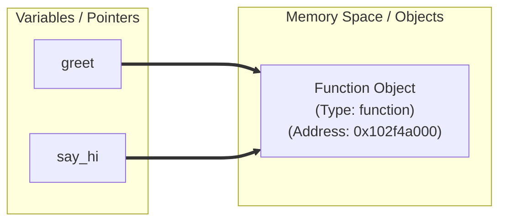
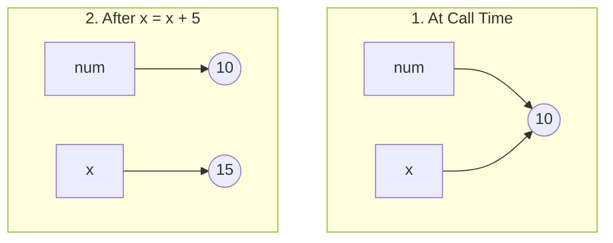
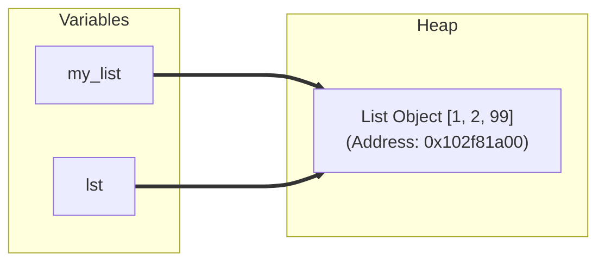
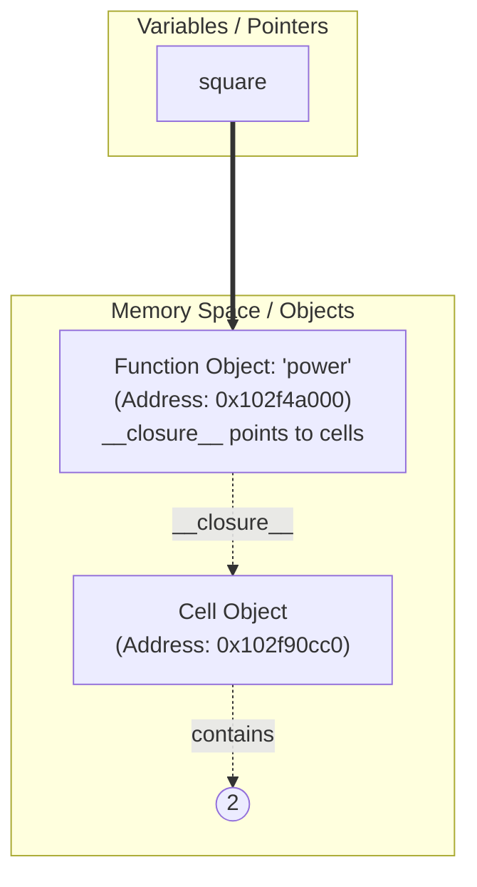
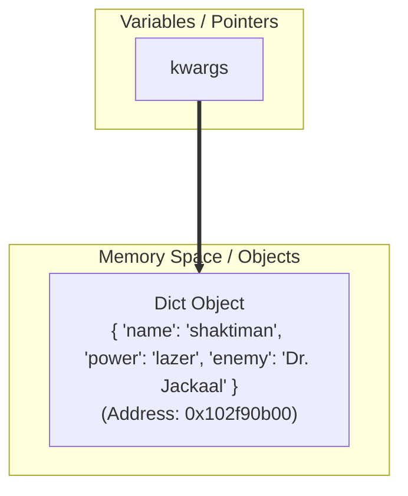
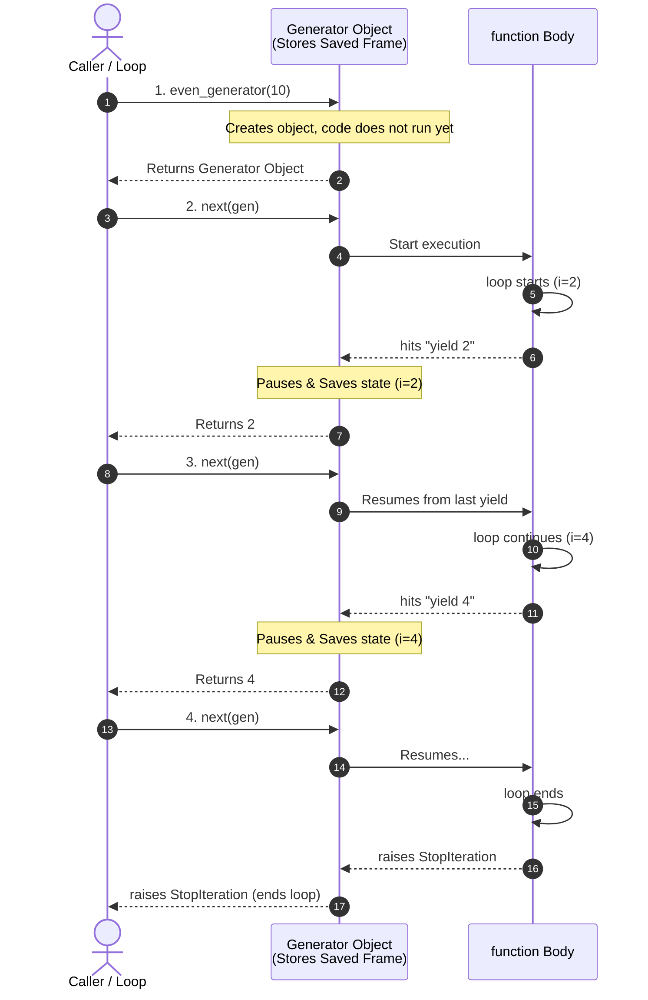

# Python Functions: Under the Hood & Deep Down ⚙️

In Python, functions are much more than just blocks of reusable code. To truly master Python, you must understand how functions are represented in memory, how variables are passed, and how scopes behave under the hood.

---

## 🔑 1. Functions are First-Class Objects

In Python, **everything is an object**, including functions! When you define a function:

```python
def square(num):
    return num ** 2
```

Python does two things behind the scenes:
1. It creates a **function object** in Heap memory (of type `<class 'function'>`).
2. It creates a variable named `square` that holds a **memory reference (pointer)** to that function object.

### Reference Copying Example:
Since the function name is just a pointer, you can assign it to another variable:

```python
>>> def greet():
...     return "Hello!"
...
>>> say_hi = greet
>>> id(greet) == id(say_hi)
True  # Both point to the exact same memory address!
```

#### 🗺️ Memory Reference Layout for Functions:


---

## 🔄 2. Argument Passing: Pass-by-Object-Reference

Python uses a mechanism called **Pass-by-Object-Reference** (sometimes called *pass-by-assignment*). 
When you pass a variable to a function, Python passes the **memory reference** of the object, not a copy of the object itself.

However, how the function behaves depends entirely on whether the object is **mutable** or **immutable**.

### Case A: Passing an Immutable Object (e.g., Integer, String, Tuple)
If you pass an immutable object and modify it inside the function, Python **cannot** change the object in place. Instead, it creates a new object in memory.

```python
def update_val(x):
    print("Inside start:", id(x)) # Same address as 'num'
    x = x + 5
    print("Inside end:", id(x))   # New address!

num = 10
print("Outside start:", id(num))
update_val(num)
print("Outside end:", num)      # Remains 10
```

#### 🗺️ Step-by-Step Memory Flow:
1. **At call time:** Both `num` (outside) and `x` (inside) point to the exact same integer object `10` in memory.
2. **On modification (`x = x + 5`):** Since integers are immutable, Python creates a new object `15` and points `x` to it. The original `num` still points to `10`.



---

### Case B: Passing a Mutable Object (e.g., List, Dict, Set)
If you pass a mutable object and modify it in-place inside the function, the changes **will affect** the caller's object because both point to the exact same mutable object in memory.

```python
def add_item(lst):
    print("Inside start:", id(lst)) # Same address as 'my_list'
    lst.append(99)                  # Modifying in-place

my_list = [1, 2]
print("Outside start:", id(my_list))
add_item(my_list)
print("Outside end:", my_list)     # Output: [1, 2, 99]
```

#### 🗺️ Step-by-Step Memory Flow:
Because a list is mutable, `.append()` modifies the list **in-place at its existing memory address**. No new list is created; both `my_list` and `lst` continue pointing to the same address.



---

## 🥞 3. The Call Stack & Execution Frames

When a function executes, Python manages variables using the **Call Stack**:

1. **Stack Frame Created**: When a function is called, Python pushes a new **Frame** (activation record) onto the call stack. This frame stores local variables and parameters.
2. **Stack Frame Destroyed**: When the function returns, its frame is popped off the call stack. All local variables inside that frame are discarded (and garbage collected if no other reference points to them).

```
   |                        |
   |------------------------|
   | Frame: add_item()      | <--- Active frame (local variable 'lst')
   |------------------------|
   | Frame: Global Scope    | <--- Global frame (variable 'my_list')
   |________________________|
         CALL STACK
```

---

## 🔍 4. Variable Scope & The LEGB Rule

When you reference a variable inside a function, Python searches for it in a specific order: **LEGB**.

1. **L (Local)**: Variables defined inside the current function.
2. **E (Enclosing)**: Variables in any enclosing/outer helper functions (relevant in nested functions).
3. **G (Global)**: Variables defined at the top-level of the module/file.
4. **B (Built-in)**: Names preloaded in Python (e.g., `print`, `sum`, `range`).

```
   [ Local ] -> [ Enclosing ] -> [ Global ] -> [ Built-in ]
   (Narrowest)                                 (Broadest)
```

> [!WARNING]
> If you try to modify a Global variable inside a function without the `global` keyword, Python will create a new **Local** variable instead:
> ```python
> x = 10
> def change():
>     x = 20 # Creates a LOCAL x, leaving global x as 10
> ```

---

## 🔒 5. Closures & Nested Functions (Memory Deep Dive)

A **Closure** is a powerful feature in Python where a nested function remembers and retains access to variables from its outer (enclosing) scope, even after the outer function has finished executing and its stack frame has been popped off.

### The 3 Conditions for a Closure to Exist:
1. We must have a **nested function** (a function inside a function).
2. The inner nested function must **reference a variable** from the outer function's scope.
3. The outer function must **return** the inner nested function.

---

### Example: The Power Factory
Let's define a function that builds custom power functions (like squares or cubes):

```python
def power_factory(exponent):
    # 'exponent' is an enclosing variable
    def power(base):
        # 'power' references 'exponent' from its birthplace
        return base ** exponent
    return power

# 'square' is a closure that remembers exponent=2
square = power_factory(2)

# 'cube' is a closure that remembers exponent=3
cube = power_factory(3)

print(square(5)) # Output: 25
print(cube(5))   # Output: 125
```

---

### How Does This Work in Memory? (Under the Hood)

Normally, when a function like `power_factory(2)` finishes executing, its stack frame (containing `exponent`) is popped off the Call Stack and destroyed.

However, since `power_factory` returns the inner `power` function object, Python detects that `power` relies on `exponent`. 
Instead of deleting `exponent`, Python:
1. Packages the `exponent` variable into a special **Cell Object** in Heap memory.
2. Attaches a reference to this cell inside the inner function's special **`__closure__`** dunder attribute.
3. The variables in `__closure__` stay alive as long as the returned function object is referenced!

#### 🗺️ Memory Reference Layout for Closures:


---

### 🔍 Inspecting a Closure's Backpack
You can actually peek inside a function's `__closure__` attribute to see the values it is holding onto in memory:

```python
# 1. Inspect the __closure__ tuple
print(square.__closure__)
# Output: (<cell at 0x102f90cc0: int object at 0x100223f10>,)

# 2. Extract the actual value stored inside the cell
print(square.__closure__[0].cell_contents)
# Output: 2
```

---

## 🏷️ 6. Keyword Arguments (`**kwargs`) Under the Hood

Just like `*args` packs positional arguments into a **tuple**, the double asterisk **`**kwargs`** packs keyword arguments (named arguments) into a **dictionary** in memory.

### The Problem Setup:
We want a function that can accept any number of key-value pairs representing entity attributes (like a hero's name, power, enemy, etc.).

```python
def print_kwargs(**kwargs):
    # 'kwargs' is a standard Python dictionary
    for key, value in kwargs.items():
        print(f"{key}: {value}")
```

When you call:
```python
print_kwargs(name="shaktiman", power="lazer", enemy="Dr. Jackaal")
```

### What happens in memory?
1. Python creates a new **Dictionary Object** in the Heap.
2. It populates it with the passed key-value pairs: `{'name': 'shaktiman', 'power': 'lazer', 'enemy': 'Dr. Jackaal'}`.
3. The local parameter `kwargs` in the function's execution frame points to this dictionary object.

#### 🗺️ Memory Reference Layout for `**kwargs`:


### 💡 key points on `**kwargs`:
* **Naming**: The word `kwargs` is just a standard naming convention (short for *keyword arguments*). Only the `**` is syntactically required.
* **Dictionary Methods**: Because `kwargs` is a dictionary, you can use all standard dictionary methods inside the function, such as `kwargs.keys()`, `kwargs.values()`, or checking for a key:
  ```python
  if "power" in kwargs:
      print(f"Hero power is {kwargs['power']}")
  ```

---

## ⚡ 7. Generator Functions & `yield` Under the Hood

Standard functions use **`return`** to send back a value. When a function returns, its **execution frame is destroyed**, and all local variables are lost.

A **Generator Function** uses **`yield`** instead of `return`. It allows a function to produce a sequence of values over time, pausing and resuming its execution state on demand!

### The Problem Setup:
We want to generate even numbers up to a specified limit.

```python
def even_generator(limit):
    for i in range(2, limit + 1, 2):
        yield i
```

---

### How Generator Execution Works Under the Hood:

1. **Instantiation**:
   When you call `gen = even_generator(10)`, Python **does not run the code** inside the function. Instead, it returns a **generator object** (which is a special type of iterator).
   
2. **First `next()` Call (or start of `for` loop)**:
   Python enters the function and runs the code until it hits the first `yield i` (where `i = 2`).
   * The function **pauses** execution.
   * Its execution state (including local variables like `i` and `limit`) is saved inside the generator object.
   * The value `2` is returned to the caller.

3. **Subsequent `next()` Calls**:
   Python resumes execution **directly after the last `yield` statement**. It continues the loop, increments `i` to `4`, and hits `yield i` again.
   * Execution pauses again, state is saved, and `4` is returned.

4. **Termination**:
   Once the loop ends (reaches the limit), the function terminates. Python automatically raises a `StopIteration` exception, which signals to the `for` loop to end cleanly.

---

### 🗺️ The Pause and Resume Cycle (Sequence Flow)



---

### 📊 `return` vs. `yield` Comparison

| Feature | `return` | `yield` |
| :--- | :--- | :--- |
| **Execution** | Runs to completion. | Pauses and resumes. |
| **Memory** | Returns the entire list/result at once (high memory for large data). | Produces one value at a time on demand (very low memory). |
| **State Retention** | Discards stack frame and local variables. | Suspends and saves the frame state. |
| **Object Returned** | The computed value/result. | A generator iterator object. |


