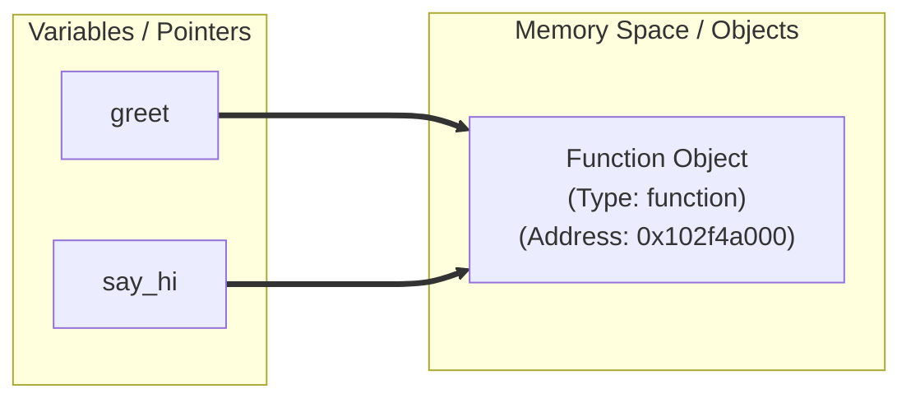
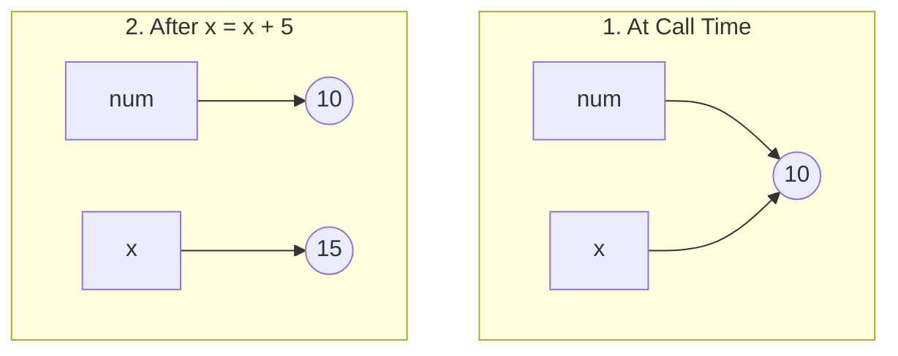
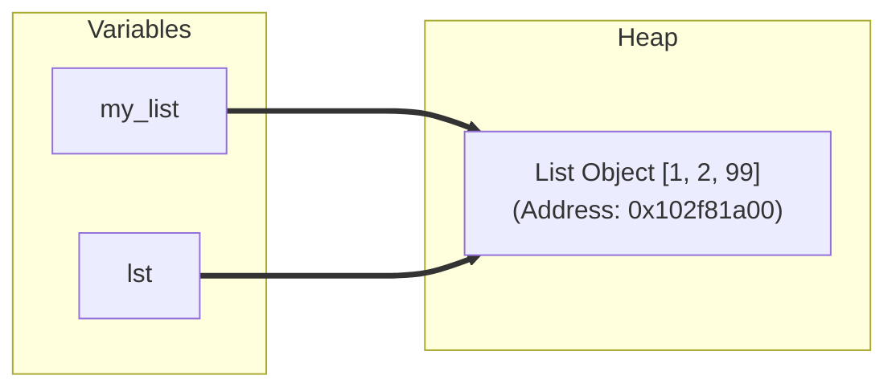

# Python Functions: Under the Hood & Deep Down ⚙️

In Python, functions are much more than just blocks of reusable code. To truly master Python, you must understand how functions are represented in memory, how variables are passed, and how scopes behave under the hood.

---

## 🔑 1. Functions are First-Class Objects

In Python, **everything is an object**, including functions! When you define a function:

```python
def square(num):
    return num ** 2
```

Python does two things behind the scenes:
1. It creates a **function object** in Heap memory (of type `<class 'function'>`).
2. It creates a variable named `square` that holds a **memory reference (pointer)** to that function object.

### Reference Copying Example:
Since the function name is just a pointer, you can assign it to another variable:

```python
>>> def greet():
...     return "Hello!"
...
>>> say_hi = greet
>>> id(greet) == id(say_hi)
True  # Both point to the exact same memory address!
```

#### 🗺️ Memory Reference Layout for Functions:


---

## 🔄 2. Argument Passing: Pass-by-Object-Reference

Python uses a mechanism called **Pass-by-Object-Reference** (sometimes called *pass-by-assignment*). 
When you pass a variable to a function, Python passes the **memory reference** of the object, not a copy of the object itself.

However, how the function behaves depends entirely on whether the object is **mutable** or **immutable**.

### Case A: Passing an Immutable Object (e.g., Integer, String, Tuple)
If you pass an immutable object and modify it inside the function, Python **cannot** change the object in place. Instead, it creates a new object in memory.

```python
def update_val(x):
    print("Inside start:", id(x)) # Same address as 'num'
    x = x + 5
    print("Inside end:", id(x))   # New address!

num = 10
print("Outside start:", id(num))
update_val(num)
print("Outside end:", num)      # Remains 10
```

#### 🗺️ Step-by-Step Memory Flow:
1. **At call time:** Both `num` (outside) and `x` (inside) point to the exact same integer object `10` in memory.
2. **On modification (`x = x + 5`):** Since integers are immutable, Python creates a new object `15` and points `x` to it. The original `num` still points to `10`.



---

### Case B: Passing a Mutable Object (e.g., List, Dict, Set)
If you pass a mutable object and modify it in-place inside the function, the changes **will affect** the caller's object because both point to the exact same mutable object in memory.

```python
def add_item(lst):
    print("Inside start:", id(lst)) # Same address as 'my_list'
    lst.append(99)                  # Modifying in-place

my_list = [1, 2]
print("Outside start:", id(my_list))
add_item(my_list)
print("Outside end:", my_list)     # Output: [1, 2, 99]
```

#### 🗺️ Step-by-Step Memory Flow:
Because a list is mutable, `.append()` modifies the list **in-place at its existing memory address**. No new list is created; both `my_list` and `lst` continue pointing to the same address.



---

## 🥞 3. The Call Stack & Execution Frames

When a function executes, Python manages variables using the **Call Stack**:

1. **Stack Frame Created**: When a function is called, Python pushes a new **Frame** (activation record) onto the call stack. This frame stores local variables and parameters.
2. **Stack Frame Destroyed**: When the function returns, its frame is popped off the call stack. All local variables inside that frame are discarded (and garbage collected if no other reference points to them).

```
   |                        |
   |------------------------|
   | Frame: add_item()      | <--- Active frame (local variable 'lst')
   |------------------------|
   | Frame: Global Scope    | <--- Global frame (variable 'my_list')
   |________________________|
         CALL STACK
```

---

## 🔍 4. Variable Scope & The LEGB Rule

When you reference a variable inside a function, Python searches for it in a specific order: **LEGB**.

1. **L (Local)**: Variables defined inside the current function.
2. **E (Enclosing)**: Variables in any enclosing/outer helper functions (relevant in nested functions).
3. **G (Global)**: Variables defined at the top-level of the module/file.
4. **B (Built-in)**: Names preloaded in Python (e.g., `print`, `sum`, `range`).

```
   [ Local ] -> [ Enclosing ] -> [ Global ] -> [ Built-in ]
   (Narrowest)                                 (Broadest)
```

> [!WARNING]
> If you try to modify a Global variable inside a function without the `global` keyword, Python will create a new **Local** variable instead:
> ```python
> x = 10
> def change():
>     x = 20 # Creates a LOCAL x, leaving global x as 10
> ```

---

## 🔒 5. Closures & Nested Functions

A **Closure** occurs when a nested function remembers and retains access to variables from its outer (enclosing) scope, even after the outer function has finished executing and its stack frame has been popped off.

```python
def power_factory(exponent):
    # 'exponent' is in the enclosing scope
    def power(base):
        return base ** exponent
    return power

square = power_factory(2)
cube = power_factory(3)

print(square(5)) # Output: 25
print(cube(5))   # Output: 125
```

### How does this work in memory?
Even though `power_factory(2)` has completed and its frame is gone:
- The inner function `power` keeps a special reference to `exponent` inside its `__closure__` attribute.
- This prevents the outer variable from being garbage collected!
