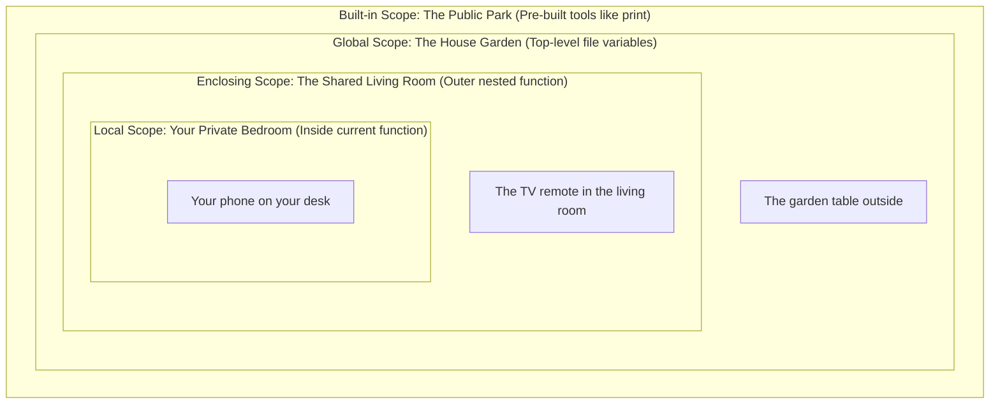

# Python Scopes: The Magic Glasses Guide 👓

Have you ever created a variable inside a function, tried to print it outside, and Python threw a scary `NameError`? 

That is because of **Scope**! In simple terms, scope is the area of your code where a variable is allowed to be seen and used.

Think of scopes as **one-way glass windows**:
* You can look **out** of your room to see what is happening in the garden.
* But someone standing in the garden **cannot look inside** your room to see what is on your desk!

Let's explore how Python's eyes work using the famous **LEGB Rule**!

---

## 🏘️ 1. The LEGB Neighborhood Analogy

Imagine you are sitting in your bedroom. You are looking for something. Python searches for it in this exact order:



---

## 🔎 2. The 4 Layers of Visibility

Let's see what each layer looks like in real code.

### 🏠 Layer 1: Local Scope (L) ➡️ *Your Private Bedroom*
Any variable you create inside a function belongs only to that function. It is created when the function starts and is thrown away when the function ends.

```python
def my_bedroom():
    secret_diary = "Private thoughts" # 🔒 Local variable
    print(secret_diary)

my_bedroom()

# ❌ Trying to read it from the street:
print(secret_diary) 
# Result: NameError! Python says "I can't see any diary here!"
```

---

### 🛋️ Layer 2: Enclosing Scope (E) ➡️ *The Shared Living Room*
This layer only appears when you put a function inside another function (nested functions). The inner function can look "out" to see variables in the outer function.

```python
def living_room():
    tv_channel = "Sports" # 📺 Enclosing variable
    
    def my_bedroom():
        # You can see the living room TV from your bedroom door!
        print("Watching:", tv_channel) 
        
    my_bedroom()

living_room()
# Output: Watching: Sports
```

---

### 🌳 Layer 3: Global Scope (G) ➡️ *The House Garden*
Variables created at the very top of your file (outside of any functions) are Global. Anyone inside the house (any function) can look out the window and see them.

```python
garden_tree = "Mango Tree" # 🌳 Global variable

def my_bedroom():
    print("I can see the:", garden_tree) # Looks out the window

my_bedroom()
# Output: I can see the: Mango Tree
```

---

### 🏞️ Layer 4: Built-in Scope (B) ➡️ *The Public Park*
These are tools that Python pre-installs for you. They are always available from anywhere in the country (your code), like `print()`, `len()`, or `range()`.

```python
# len() is built-in; you don't need to define it
print(len("hello"))  # Output: 5
```

---

## 🛠️ 3. Modifying Scopes: Getting a "Permit"

By default, Python lets you **look at** global or enclosing variables, but **you cannot change them** from inside a function. If you try to change them, Python gets confused and creates a new local variable with the same name instead!

To force Python to modify them, you need a "permit" keyword.

### 🔑 Permit A: `global` (Remodeling the Garden)
If you want to edit a global variable from inside your bedroom, you must declare it as `global`:

```python
gold_coins = 100 # Global variable in the garden

def spend_coins():
    global gold_coins # 📜 "I have a permit to change the global coins!"
    gold_coins = gold_coins - 20

spend_coins()
print(gold_coins) # Output: 80 (It actually changed!)
```

> [!WARNING]
> If you forget the `global` keyword:
> ```python
> gold_coins = 100
> def spend_coins():
>     gold_coins = 50 # ❌ Creates a NEW local coin stack; global coins stay 100!
> ```

---

### 🔑 Permit B: `nonlocal` (Changing the Living Room TV Channel)
If you are inside a nested function (bedroom) and want to change a variable in the outer function (living room), you must use `nonlocal`:

```python
def living_room():
    tv_channel = "News"
    
    def my_bedroom():
        nonlocal tv_channel # 📜 "I have a permit to change the living room TV!"
        tv_channel = "Cartoons"
        
    my_bedroom()
    print("Living room TV is now showing:", tv_channel)

living_room()
# Output: Living room TV is now showing: Cartoons
```

---

## 📊 Summary Cheat-Sheet

| Term | Analogy | Access Level | How to modify it? |
| :--- | :--- | :--- | :--- |
| **Local** | Your Bedroom | Only visible inside the function. | Directly |
| **Enclosing** | Living Room | Visible inside nested helper functions. | Use `nonlocal` |
| **Global** | Garden | Visible to all functions in the file. | Use `global` |
| **Built-in** | Public Park | Pre-built by Python, visible everywhere. | Do not modify |

---

## 🧠 4. What is Lexical Scope (Static Scope)?

The word **"Lexical"** simply means **"relating to written text"**.

In Python, variables are resolved using **Lexical Scope**. This means:
> A function's scope is determined by **where the function is written (defined) in the code**, not where it is called at runtime.

Think of it as a function **remembering its birthplace**. No matter where you take the function later in the code, it will always look for variables based on where it was born.

### The Birthplace Example:

```python
x = 10

def outer():
    x = 20
    def inner():
        # inner() was born inside outer(), so it looks at outer's x
        print(x) 
    return inner

# We call outer() which returns the inner() function
my_func = outer() 

x = 30  # Change global x to 30

# We run the function now in global scope
my_func() 
```

#### ❓ What does `my_func()` print?
It prints **`20`**, not `30`!

* **Why?** Even though we called the function in the global scope where `x` is `30`, the function was physically defined (born) inside `outer()` where `x` was `20`. Because of Lexical Scope, it retains its link to its birthplace. (This behavior is what makes **Closures** possible!).

