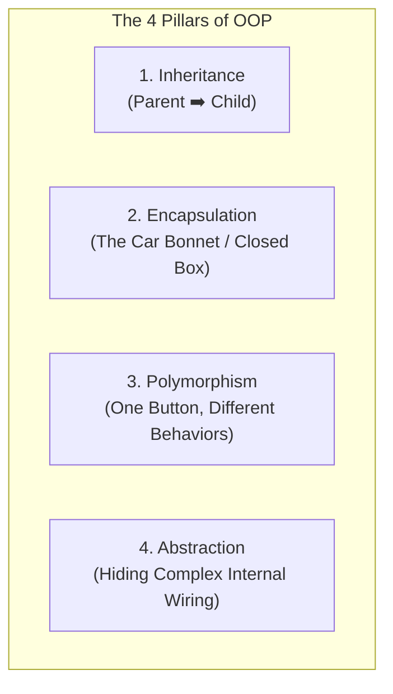

# Python Object-Oriented Programming (OOP): The Easiest Guide 🚗

Object-Oriented Programming (OOP) sounds scary, but it is just a way of structuring code to reflect the real world. 

Let's understand OOP using the simplest analogy ever: **The Car Factory**!

---

## 🏗️ 1. Class vs. Object (Blueprint vs. Real Car)

Think of a **Class** as a **Blueprint** (architectural drawing) and an **Object** as the **Actual Car** built using that blueprint.

* **Class (`Car`)**: The blueprint paper. It defines what attributes a car *should* have (brand, model) and what actions it *can* do (drive, brake). You cannot drive a paper blueprint!
* **Object (`my_car`)**: The actual physical car sitting in your driveway. You can manufacture 1,000 different cars from just 1 blueprint.

```python
# 1. THE BLUEPRINT (Class)
class Car:
    def __init__(self, brand, model):
        # 'self' refers to the specific car being built!
        self.brand = brand
        self.model = model

# 2. THE REAL CARS (Objects / Instances)
car1 = Car("Tesla", "Model S")
car2 = Car("Ford", "Mustang")

print(car1.brand) # Output: Tesla
print(car2.brand) # Output: Ford
```

> [!TIP]
> **What is `self`?**
> Think of `self` as pointing to **MY** car. When `car1.drive()` is called, `self` tells Python: *"Hey! Move `car1`, not `car2`!"*

---

## 🏛️ 2. The 4 Pillars of OOP Made Simple

OOP rests on 4 main concepts. Let's break down each one with a simple real-world picture:



---

### 👑 Pillar 1: Inheritance (Parent ➡️ Child)
**Analogy**: You inherit your eyes from your parents, but you also have your own unique personality.

Instead of writing a new blueprint from scratch for an Electric Car, we **inherit** everything from the standard `Car` blueprint and just add a `battery_size`!

```python
# Parent Class (Base)
class Car:
    def __init__(self, brand, model):
        self.brand = brand
        self.model = model

# Child Class (Derived from Car)
class ElectricCar(Car):
    def __init__(self, brand, model, battery_size):
        # super() calls the Parent's __init__
        super().__init__(brand, model)
        self.battery_size = battery_size

my_ev = ElectricCar("Tesla", "Model Y", "85kWh")
print(my_ev.brand)        # Inherited from Car! (Tesla)
print(my_ev.battery_size) # Unique to ElectricCar! (85kWh)
```

> [!IMPORTANT]
> **Why do we use `super()` in `__init__()`, but NOT when reading `self.brand` in child methods?**
> * **`super()`** is used to **call parent methods** (like calling `Car.__init__()` during object initialization).
> * Once `super().__init__(brand, model)` runs, `self.brand` and `self.model` are **attached directly to `self` in memory**.
> * Inside any child method (e.g. `electric_car_name(self)`), `self` already owns `self.brand` and `self.model`. You read them directly as `self.brand` without needing `super()`.
> * **Rule of Thumb**:
>   - Use **`self.attribute_name`** to read/write variables attached to the object.
>   - Use **`super().method_name()`** only when invoking parent class methods.

---

### 🔒 Pillar 2: Encapsulation (The Closed Car Bonnet)
**Analogy**: When you drive, you use the steering wheel and pedals. You don't reach under the bonnet with your bare hands to touch the engine pistons directly while driving!

Encapsulation means **hiding private data** inside a class so outside code cannot accidentally mess it up. We make an attribute private by putting two underscores (`__`) in front of its name.

```python
class Car:
    def __init__(self, brand):
        self.__brand = brand # 🔒 Private attribute! Cannot be accessed directly

    # Getter method (Public window to view the private brand)
    def get_brand(self):
        return self.__brand + " (Official)"

my_car = Car("Toyota")

# ❌ Direct access fails:
# print(my_car.__brand) -> AttributeError!

# ✅ Safe access via Getter:
print(my_car.get_brand()) # Output: Toyota (Official)
```

---

### 🎭 Pillar 3: Polymorphism (Same Button, Different Action)
**Analogy**: A "Play" button on your phone plays music. The "Play" button on YouTube plays a video. It's the same button name, but it behaves differently based on what device you press it on!

Polymorphism allows different classes to have methods with the **same name**, but each executes its own custom behavior.

```python
class Car:
    def fuel_type(self):
        return "Petrol or Diesel ⛽"

class ElectricCar:
    def fuel_type(self):
        return "Electric Charge ⚡"

# Same method name 'fuel_type()', different results!
generic_car = Car()
ev = ElectricCar()

print(generic_car.fuel_type()) # Output: Petrol or Diesel ⛽
print(ev.fuel_type())          # Output: Electric Charge ⚡
```

---

### 🧱 Pillar 4: Abstraction (Hiding Complexity)
**Analogy**: When you press the brake pedal in a car, you don't need to know how brake fluid pressure, calipers, and hydraulic lines work. You just press the pedal and the car stops.

Abstraction hides complex internal logic and only shows the simple, essential interface to the user.

---

## 🛠️ 3. Special OOP Features in Python

### A. Class Variables (The Factory Counter)
A standard attribute (like `self.model`) belongs to **one specific car**. 
A **Class Variable** belongs to the **entire factory** (shared across ALL cars created).

```python
class Car:
    total_cars = 0 # Class variable counter

    def __init__(self, brand):
        self.brand = brand
        Car.total_cars += 1 # Increments every time a new car is made!

car1 = Car("BMW")
car2 = Car("Audi")

print(Car.total_cars) # Output: 2
```

> [!TIP]
> **Why access `Car.total_cars` (Class Name) instead of `car1.total_cars` (Instance Name)?**
> * **`Car.total_cars` (Recommended)**: Explicitly tells anyone reading your code: *"This is a shared variable belonging to the Class blueprint."*
> * **`car1.total_cars` (Not Recommended / Dangerous)**: Reading it works via fallback lookup, but if you do `car1.total_cars = 10`, Python will **not** update the shared class variable! Instead, it creates a brand new instance variable on `car1` that **shadows (hides)** the class variable for `car1`, leading to tricky bugs.

---

### B. Static Methods (`@staticmethod`)

A **Static Method** is a utility function that lives inside a Class for organizational purposes, but **does NOT require access to `self`** (instance data) or **`cls`** (class data).

#### Key Characteristics:
1. **No `self` Parameter**: It does not take `self` as its first argument.
2. **Independent**: It cannot read or modify instance attributes (like `self.brand`) or class variables (like `Car.total_car`).
3. **Pure Helper/Utility**: Useful for logic that logically belongs to the class concept, but works independently of any specific car object.

```python
class Car:
    def __init__(self, brand, model):
        self.brand = brand
        self.model = model

    # Static method decorator
    @staticmethod
    def get_description():
        return "Cars are motor vehicles used for transportation."

# Calling via Class Name (Recommended)
print(Car.get_description())

# Calling via Instance (Also works)
my_car = Car("Toyota", "Urban Cruiser")
print(my_car.get_description())
```

> [!NOTE]
> **Why use `@staticmethod` instead of a regular function?**
> It keeps your codebase clean and organized! If a function is specifically related to cars (e.g., validating a car VIN number or returning a general car description), putting it inside the `Car` class namespace using `@staticmethod` makes your code modular and readable.

#### 📊 Method Types Comparison in Python

| Method Type | Decorator | First Parameter | Accesses `self`? | Primary Use Case |
| :--- | :--- | :--- | :--- | :--- |
| **Instance Method** | None | `self` | **Yes** (`self.brand`) | Operating on specific object data |
| **Class Method** | `@classmethod` | `cls` | **No** (Accesses `cls.total_car`) | Operating on class-wide data / Factory constructors |
| **Static Method** | `@staticmethod` | None | **No** | Standalone helper / utility functions inside class namespace |

---

### C. Property Decorators (`@property` - Read-Only Attributes)
Sometimes you want an attribute to be readable like a normal variable (`car.model`), but you don't want anyone to overwrite it (`car.model = "something"`).

```python
class Car:
    def __init__(self, model):
        self._model = model

    @property
    def model(self):
        return self._model # Makes 'model' read-only!

my_car = Car("Corolla")
print(my_car.model) # Output: Corolla

# ❌ Trying to change it will raise an AttributeError!
# my_car.model = "Civic" 
```

---

## 📊 Summary Cheat-Sheet

| Term | Simple Meaning | Real-world Analogy |
| :--- | :--- | :--- |
| **Class** | Code Blueprint | The Car Architecture Spec Sheet |
| **Object / Instance** | The Real Item built from blueprint | A red Tesla Model S in your driveway |
| **`self`** | Refers to *this* specific instance | "My specific car" |
| **`__init__`** | Constructor / Assembly Line | Manufacturing the car upon order |
| **Inheritance** | Reusing code from a parent class | ElectricCar inheriting from basic Car |
| **Encapsulation** | Hiding private attributes (`__var`) | The locked car bonnet hiding internal wiring |
| **Polymorphism** | Same method name, different behavior | `fuel_type()` returning Petrol vs Electric |
